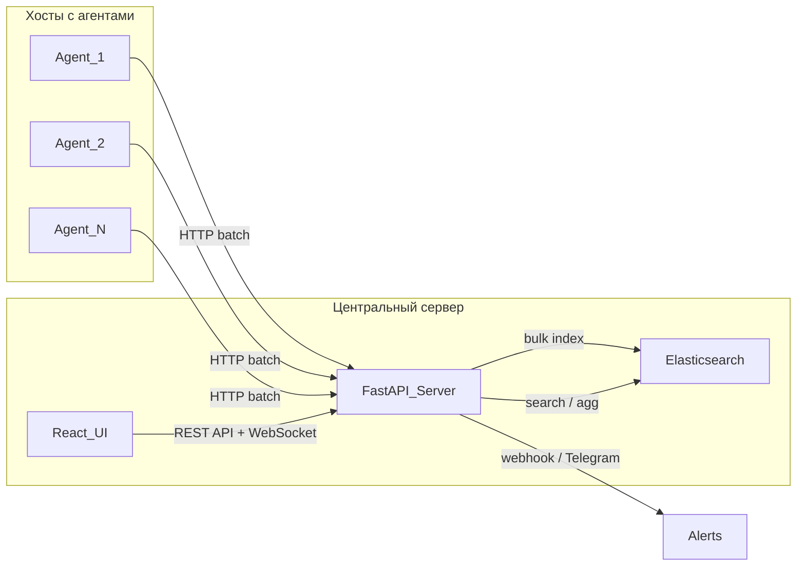

# LogVault: Система централизованного мониторинга логов

## Архитектура решения




## Структура проекта

```
c:\Users\Kordon\Project\
├── agent/                    # Сервис агента (Python)
│   ├── Dockerfile
│   ├── requirements.txt
│   ├── config.yaml           # Настройки: какие логи читать, URL сервера
│   └── src/
│       ├── main.py           # Точка входа
│       ├── config.py         # Загрузка конфигурации
│       ├── readers/          # Читатели логов
│       │   ├── base.py       # Абстрактный LogReader
│       │   ├── file_reader.py    # Чтение файлов (tail -F логика)
│       │   └── journald_reader.py # Чтение journald
│       ├── buffer.py         # Локальная буферизация (SQLite)
│       ├── transport/        # Абстракция транспорта (для перехода A->B)
│       │   ├── base.py       # Абстрактный Transport
│       │   └── http.py       # HTTP-транспорт (Вариант A)
│       └── models.py         # Pydantic-модели событий
│
├── server/                   # Центральный сервер (FastAPI)
│   ├── Dockerfile
│   ├── requirements.txt
│   └── src/
│       ├── main.py           # Точка входа FastAPI
│       ├── config.py         # Настройки (ES URL, алерты)
│       ├── auth.py           # Аутентификация агентов (API key)
│       ├── routers/
│       │   ├── ingest.py     # POST /ingest - приём логов от агентов
│       │   ├── search.py     # GET /search - полнотекстовый поиск
│       │   ├── logs.py       # GET /logs/live - WebSocket realtime
│       │   ├── stats.py      # GET /stats - агрегации для графиков
│       │   └── agents.py     # GET /agents - список агентов
│       ├── services/
│       │   ├── elasticsearch.py  # Работа с ES (index, search, agg)
│       │   ├── pipeline.py       # validate -> enrich -> index
│       │   └── alerting.py       # Правила алертов + отправка
│       └── models.py         # Pydantic-модели API
│
├── ui/                       # Веб-интерфейс (React + TypeScript)
│   ├── Dockerfile
│   ├── package.json
│   └── src/
│       ├── App.tsx
│       ├── api/              # API-клиент
│       ├── pages/
│       │   ├── Dashboard.tsx     # Графики, тепловые карты
│       │   ├── LiveLogs.tsx      # Realtime просмотр
│       │   ├── Search.tsx        # Полнотекстовый поиск + фильтры
│       │   └── Alerts.tsx        # Настройка алертов
│       ├── components/
│       │   ├── LogTable.tsx      # Таблица логов
│       │   ├── HeatMap.tsx       # Тепловая карта
│       │   ├── TimeChart.tsx     # Частота ошибок/warn по времени
│       │   └── LevelPieChart.tsx # Распределение по level
│       └── hooks/            # useWebSocket, useSearch, etc.
│
├── docker-compose.yml        # Манифест для запуска всего
├── docker-compose.agent.yml  # Отдельный compose для агента на хосте
├── .env.example              # Пример переменных окружения
└── README.md                 # Инструкция по запуску
```

## Формат события (единый контракт)

```python
class LogEvent:
    event_id: str      # UUID или hash (для идемпотентности)
    timestamp: str     # ISO 8601
    host: str          # Имя хоста агента
    agent_id: str      # Уникальный ID агента
    source: str        # Откуда лог: "/var/log/syslog", "journald:nginx", etc.
    level: str         # INFO / WARN / ERROR / DEBUG / CRITICAL
    message: str       # Текст лога
    service: str       # Имя сервиса (nginx, sshd, etc.)
    meta: dict         # Произвольные дополнительные поля
```

Этот контракт не меняется при переходе A -> B. Используется и в агенте, и в сервере, и в ES.

## Пошаговый план реализации

### Этап 1: Agent

Агент -- контейнер, который ставится на каждую машину.

- **Конфигурация** (`config.yaml`): инженер указывает, какие файлы/сервисы мониторить:

```yaml
  server_url: "http://192.168.1.10:8000"
  agent_id: "host-ubuntu-01"
  api_key: "secret-key-123"
  sources:
    - type: file
      path: "/var/log/syslog"
      service: "syslog"
    - type: file
      path: "/var/log/nginx/error.log"
      service: "nginx"
    - type: journald
      unit: "sshd"
      service: "sshd"
  

```

- **FileReader**: открывает файл, запоминает позицию (offset) в файле-маркере, читает новые строки, парсит level.
- **JournaldReader**: использует `systemd-python` или вызывает `journalctl --follow --output=json`, фильтрует по unit.
- **Buffer** (SQLite): если сервер недоступен -- события складываются в локальную БД. При восстановлении связи -- отправляются батчами.
- **HttpTransport**: POST `/ingest` батч из 100-500 событий, retry с exponential backoff.
- **Абстракция Transport**: `base.py` определяет интерфейс `send(batch)`. Сейчас реализация `HttpTransport`, в будущем -- `KafkaTransport`.
- **Dockerfile**: `python:3.12-slim`, монтируем `/var/log` и `/run/log/journal` (для journald).

### Этап 2: Server

- **FastAPI** приложение на порту 8000.
- **Auth**: каждый агент авторизуется через API-key в заголовке `X-Api-Key`. Ключи хранятся в `.env` / конфиге.
- **POST /ingest**: принимает батч, прогоняет через pipeline (`validate -> enrich -> index`). Индексирует в ES через `helpers.bulk()`. Индексы: `logs-YYYY.MM.DD`.
- **GET /search**: полнотекстовый поиск через `query_string` ES. Параметры: `q`, `level`, `agent_id`, `service`, `from_ts`, `to_ts`, `page`, `size`.
- **WebSocket /logs/live**: сервер кеширует последние N событий в очереди; UI подключается по WebSocket и получает новые события в реальном времени.
- **GET /stats**: агрегации ES -- `date_histogram` (частота по времени), `terms` (по level, service, host), данные для тепловых карт (день*час).
- **Alerting**: фоновая задача проверяет ES каждые 30 сек. Правила: "ERROR rate > N за M минут", regex-паттерны. Каналы: webhook URL и/или Telegram Bot API.
- **GET /agents**: список зарегистрированных агентов и их последний heartbeat.
- **Elasticsearch**: индекс-шаблон с правильным mapping (keyword для level/service/agent_id, text для message, date для timestamp).

### Этап 3: UI (React + TypeScript)

Библиотеки: `recharts` для графиков, `react-hot-toast` для нотификаций, `@tanstack/react-query` для API, CSS -- Tailwind.

Страницы:

- **Dashboard**: графики частоты логов по времени (line chart), pie chart по level, тепловая карта ошибок (день/час), top-сервисы по ошибкам.
- **Live Logs**: WebSocket подключение, новые строки появляются в реальном времени. Фильтр по level/service/agent. Пауза/возобновление.
- **Search**: строка поиска (полнотекст), фильтры (level, service, agent, date range). Результаты в таблице с подсветкой.
- **Alerts**: настройка правил (порог ошибок, regex), настройка каналов (webhook URL, Telegram token + chat_id). Включение/отключение.

### Этап 4: Docker Compose и запуск

- `docker-compose.yml` -- поднимает сервер + ES + UI на центральной машине.
- `docker-compose.agent.yml` -- отдельный файл для деплоя агента на удалённой машине. Агент подключается к серверу по IP/DNS.
- `.env.example` -- все переменные окружения с комментариями.
- `README.md` -- пошаговая инструкция для новичка.

### Этап 5 (будущее): Переход к варианту B

Не реализуем сейчас, но архитектура готова:

- Добавить `KafkaTransport` в `agent/src/transport/kafka.py`.
- Добавить Kafka в docker-compose.
- Сделать `Ingestor` -- consumer, использующий тот же `pipeline.py` из сервера.
- Агент переключается через `config.yaml`: `transport: kafka`.

## Безопасность

- API-key аутентификация агентов.
- Elasticsearch не торчит наружу (только внутренняя docker-сеть).
- Rate limiting на `/ingest`.
- Ограничение размера батча и payload.
- `.env` не коммитится (в `.gitignore`).

